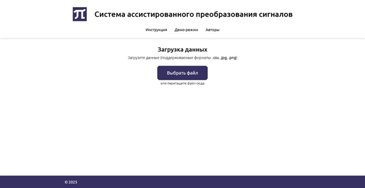
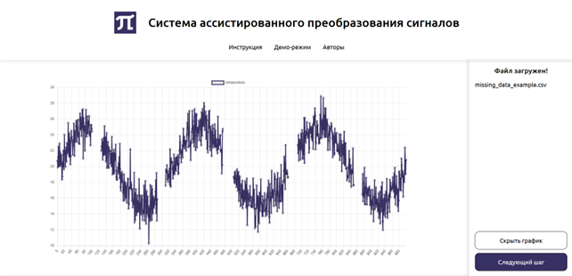
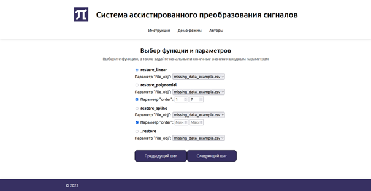
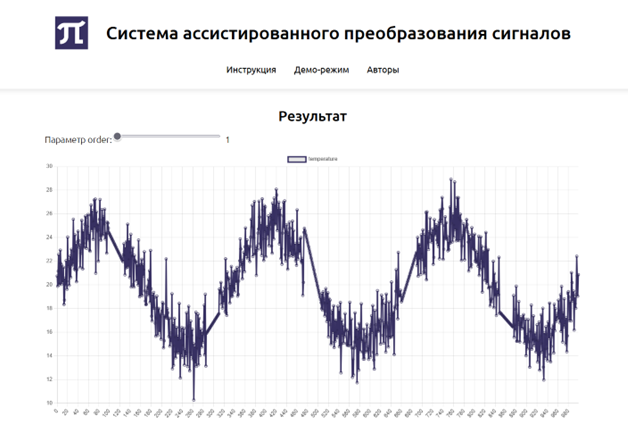

<h1>Дипломный проект</h1>

Система ассистированного преобразования сигналов для задач с плохо формализуемыми метриками качества

<b>Стэк:</b>

  
  
  
  
  
  
  

  
   
  <em>Рис. 1. Загрузка данных</em>

  
   
  <em>Рис. 2. Визуализация входных данных</em>

  
   
  <em>Рис. 3. Выбор функции и параметров</em>

  
   
  <em>Рис. 4. Результат</em>

